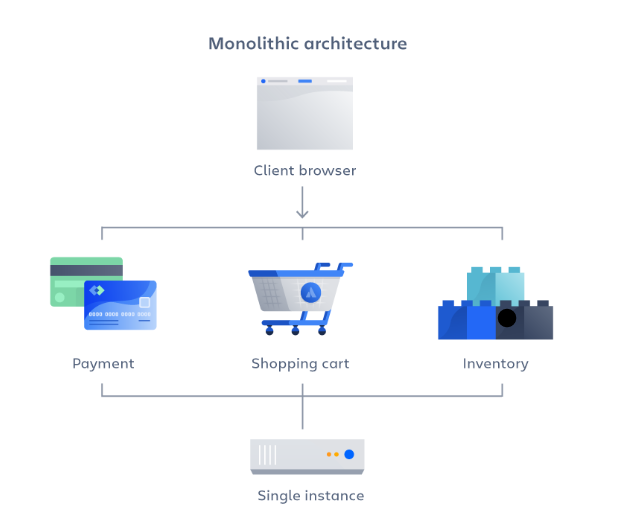
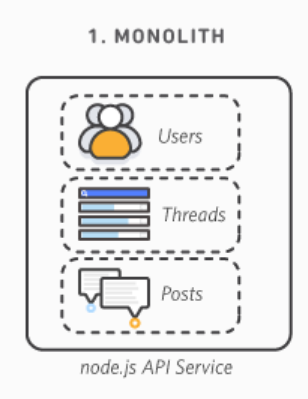
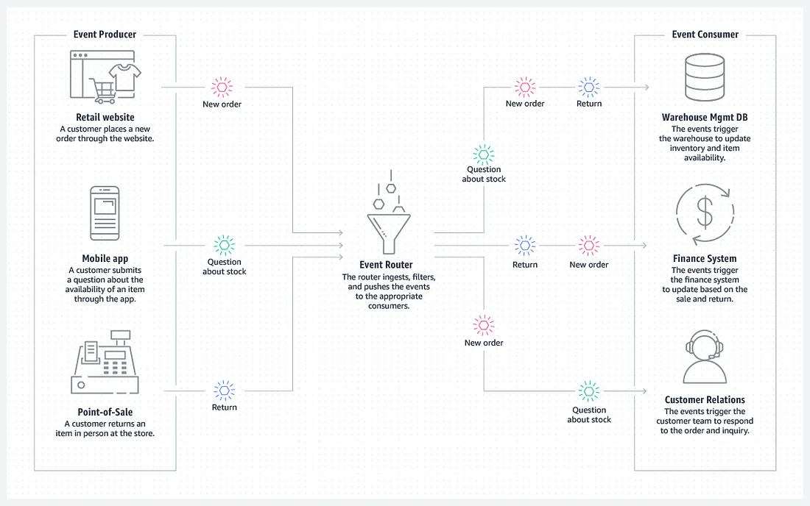

# Architecture Logicielle

- monolithique => 1 seul gros projet (MVC), micro-services => authentification (SSO), Event-Driven => Winform, Hexa => optimisation séparation des responsabilités, code métier, etc...

# TP 1 :

Faire des recherches sur chacun des 4 types d'architecture cités plus haut. Pour chacun récupérer :

- Une liste de caractéristiques
- Une définition simple et efficace
- Des exemples d'implémentation (schémas ?)
- Des exemples d'utilisation dans des projets connus
- La liste des sources (liens web) où vous avez trouvé les informations

## Monolithique

### Caractéristiques

- Base de code unique
- Généralement regroupant l'interface utilisateur, la base de données et l'application côté serveur
- Rapide et facile à concevoir
- Une seule unité à déployer
- S'exécute sur un seul serveur
- Scalabilité plus limitée parce qu'elle affecte un système entier
- Système moins flexible lorsqu'il s'agit d'ajouter des nouvelles fonctionnalités
- Pose un risque de point de défaillance unique qui entraînerait l'échec de toute l'application
- Si plus de ressources doivent être allouées, c'est tout le système qui prend les ressources => On passe très vite dans du gaspillage de ressources
- Limite l'introduction de nouvelles fonnctionnalités

|                    Avantages                    |                   Inconvénients                   |
|--------------------------------------------------|--------------------------------------------------|
|Pas besoin de traduire le code entre les services |Assez rigide : Difficile d'intégrer des nouvelles | 
|                                                  |technologies                                      |
|Plus facile à développer et à déployer            |Difficile à faire évoluer                         |
|Plus facile à tester, notamment en end-to-end     |Un changement peut modifier en cascade=>peu agile |
|Plus sécurisé, car moins de communication         |Obligé de tout rebuild et redéployer à chaque     |
|extérieure                                        |changement                                        |  
|Indépendante                                      |Une erreur peut tout arrêter, même si elle est    |
|                                                  |localisée                                         |
|Performante                                       |Nécessite une équipe bien organiqée               |

De plus en plus d'applications passent d'une architecture Monolithique à une architecture Micro-serivice

### Définition

L'architecture monolithique utilise une base de code unique pour plusieurs fonctions métiers,
chaque service sont interdépendants, ce qui implique que la moindre modification peut avoir des répercussions sur le reste de l'application.
Modèle de développement logiciel utilisant une base de code unique qui centralise des composants interdépendants afin d'exécuter différentes fonctions métier.

Une architecture monolithique peut être envisageable voire nécessaire dans des petits projets. Mais dès que le projet se complexifie, il peut être compliqué de le maintenir.
Une architecture monolithique représente un système simple, développé sur une même base de code. Généralement constitué d'un front, d'un back et d'une BDD.

### Exemples d'implémentations (schémas)

- Monolithe modulaire (ou diagramme de composants) : un seul système découpé en plusieurs modules, donc une séparation des couches existant tout de même sur une même base de code
- Diagramme de dépendances : structuration du code monolithe par fonctionnalité plutôt que par couche, limitant les interfaces

Exemple d'architecture monolithique

### Exemples d'utilisation dans des projets connus

- GitLab est sur une architecture "Monorails", basée sur le framework "Ruby on Rails"
- Instagram Server est également un système monolithe fonctionnant sous Django
- CMS (Wordpress, Shopify, Prestashop)
- Les applications Legacy (les anciennes versions de Microsoft Office)

### Sources

https://aws.amazon.com/fr/compare/the-difference-between-monolithic-and-microservices-architecture/

https://dev.to/adrianbailador/monolithic-architecture-in-net-33i2

https://medium.com/@AtefMADDOURI/architecture-microservice-vs-monolithique-8b019834ba35

https://about.gitlab.com/blog/why-were-sticking-with-ruby-on-rails/

https://handbook.gitlab.com/handbook/engineering/architecture/design-documents/modular_monolith/

https://instagram-engineering.com/static-analysis-at-scale-an-instagram-story-8f498ab71a0c

[Atlassian](https://www.atlassian.com/fr/microservices/microservices-architecture/microservices-vs-monolith)
[Amazon](https://aws.amazon.com/fr/compare/the-difference-between-monolithic-and-microservices-architecture/)
[F5](https://www.f5.com/fr_fr/glossary/monolithic-application#:~:text=Syst%C3%A8mes%20bancaires%20%E2%80%93%20De%20nombreux%20syst%C3%A8mes,qui%20les%20rend%20plus%20s%C3%BBrs.)
[IBM](https://www.ibm.com/think/topics/monolithic-architecture)
[vFunction](https://vfunction.com/blog/what-is-monolithic-application)

## Micro-services

### Caractéristiques
- Composants logiciels indépendants dotés de fonctionnalités autonomes qui communiquent entre eux à l'aide d'API.
- Nécessite davantage de planification et d'infrastructure au départ, mais devient plus facile à gérer et à maintenir dans la durée.
- Chaque microservice est une entité logicielle indépendante qui nécessite un déploiement conteneurisé individuel.
- Nécessite des outils de débogage avancés pour suivre l'échange de données entre plusieurs microservices.
- Modifications des microservices individuels sans affecter l'ensemble de l'application.
- Allocations des ressources individuellement, en fonction des besoins => Economie des coûts

- Architecture de plus en plus populaire

### Définition
Une architecture micro-service représente des systèmes plus complexes où chaque fonctionnalité est indépendante.
Ils offrent une meilleure tolérance aux problèmes techniques et une plus grande flexibilité par rapport aux architectures monolithiques.

### Exemples d'implémentations

### Cas d'utilisations
- Netflix (une des premières grosses entreprises a être passée de monolithique à micro-services, elle à même remporté le 2015 JAX Special Jury Award)
- Microsoft Office
- Amazon
- Soundcloud

### Sources
- AWS
- talend

https://www.allthingsdistributed.com/2019/08/modern-applications-at-aws.html

https://developers.soundcloud.com/blog/microservices-and-the-monolith

## Event-driven

### Caractéristiques

- Couplage moins étroit (le producteur et le consommateur ne se connaissent pas)
- Grande flexibilité
- En cas de panne, les messages s'empilent dans une file d'attente et ne sont pas perdus
- Peut être implémenté dans des microservices, mais il est moins recommandé dans une solution monolithe
- Offre un traitement en temps réel, ou à faible latence
- Les événéments sont persistants, ils sont conservés pendant un certain temps pour qu'ils puissent être consommés à n'importe quel moment

### Définition

Un événement correspond à un changement d'état, une mise à jour ou tout autre point d'intérêt dans le système. L'EDA (Event-Driven Architecture) capture, traite et publie tous ces événements de façon asynchrone.

Un événement arrive, le producteur l'annonce. Un bus va diffuser l'annonce du producteur, le consommateur va écouter et réagir à l'événement.

### Exemples d'implémentations

### Cas d'utilisations

- Twitter
- UberEats (notamment pour le système de publicités)

### Sources

https://www.ibm.com/fr-fr/topics/event-driven-architecture

https://www.confluent.io/learn/event-driven-architecture/

https://aws.amazon.com/fr/event-driven-architecture/

https://fr.wikipedia.org/wiki/Architecture_orient%C3%A9e_%C3%A9v%C3%A9nements

https://medium.com/@seetharamugn/the-complete-guide-to-event-driven-architecture-b25226594227

https://dev.to/yokwejuste/understanding-event-driven-architecture-110o

https://www.uber.com/en-FR/blog/real-time-exactly-once-ad-event-processing/

## Hexa

### Caractéristiques

### Définition

### Exemples d'implémentations

### Cas d'utilisations

### Sources