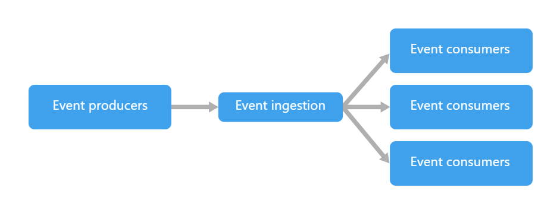

# Architecture Logicielle

- monolithique => 1 seul gros projet (MVC), micro-services => authentification (SSO), Event-Driven => Winform, Hexa => optimisation séparation des responsabilités, code métier, etc...

# TP 1 :

Faire des recherches sur chacun des 4 types d'architecture cités plus haut. Pour chacun récupérer :

- Une liste de caractéristiques
- Une définition simple et efficace
- Des exemples d'implémentation (schémas ?)
- Des exemples d'utilisation dans des projets connus
- La liste des sources (liens web) où vous avez trouvé les informations

## Monolithique

### Caractéristiques

- Base de code unique
- Généralement regroupant l'interface utilisateur, la base de données et l'application côté serveur
- Rapide et facile à concevoir
- Une seule unité à déployer
- S'exécute sur un seul serveur
- Scalabilité plus limitée parce qu'elle affecte un système entier
- Système moins flexible lorsqu'il s'agit d'ajouter des nouvelles fonctionnalités
- Pose un risque de point de défaillance unique qui entraînerait l'échec de toute l'application
- Si plus de ressources doivent être allouées, c'est tout le système qui prend les ressources => On passe très vite dans du gaspillage de ressources
- Limite l'introduction de nouvelles fonnctionnalités

|                    Avantages                    | Inconvénients                                     |
|--------------------------------------------------|---------------------------------------------------|
|Pas besoin de traduire le code entre les services | Assez rigide : Difficile d'intégrer des nouvelles | 
|                                                  | technologies                                      |
|Plus facile à développer et à déployer            | Difficile à faire évoluer                         |
|Plus facile à tester, notamment en end-to-end     | Un changement peut modifier en cascade=>peu agile |
|Plus sécurisé, car moins de communication         | Obligé de tout rebuild et redéployer à chaque     |
|extérieure                                        | changement                                        |  
|Indépendante                                      | Une erreur peut tout arrêter, même si elle est    |
|                                                  | localisée                                         |
|Performante                                       | Nécessite une équipe bien organisée               |

De plus en plus d'applications passent d'une architecture Monolithique à une architecture Micro-serivice

### Définition

L'architecture monolithique utilise une base de code unique pour plusieurs fonctions métiers,
chaque service sont interdépendants, ce qui implique que la moindre modification peut avoir des répercussions sur le reste de l'application.
Modèle de développement logiciel utilisant une base de code unique qui centralise des composants interdépendants afin d'exécuter différentes fonctions métier.

Une architecture monolithique peut être envisageable voire nécessaire dans des petits projets. Mais dès que le projet se complexifie, il peut être compliqué de le maintenir.
Une architecture monolithique représente un système simple, développé sur une même base de code. Généralement constitué d'un front, d'un back et d'une BDD.

### Exemples d'implémentations (schémas)

- Monolithe modulaire (ou diagramme de composants) : un seul système découpé en plusieurs modules, donc une séparation des couches existant tout de même sur une même base de code
- Diagramme de dépendances : structuration du code monolithe par fonctionnalité plutôt que par couche, limitant les interfaces

Exemple d'architecture monolithique

### Exemples d'utilisation dans des projets connus

- GitLab est sur une architecture "Monorails", basée sur le framework "Ruby on Rails"
- Instagram Server est également un système monolithe fonctionnant sous Django
- CMS (Wordpress, Shopify, Prestashop)
- Les applications Legacy (les anciennes versions de Microsoft Office)

### Sources

https://aws.amazon.com/fr/compare/the-difference-between-monolithic-and-microservices-architecture/

https://dev.to/adrianbailador/monolithic-architecture-in-net-33i2

https://medium.com/@AtefMADDOURI/architecture-microservice-vs-monolithique-8b019834ba35

https://about.gitlab.com/blog/why-were-sticking-with-ruby-on-rails/

https://handbook.gitlab.com/handbook/engineering/architecture/design-documents/modular_monolith/

https://instagram-engineering.com/static-analysis-at-scale-an-instagram-story-8f498ab71a0c

[Atlassian](https://www.atlassian.com/fr/microservices/microservices-architecture/microservices-vs-monolith)
[Amazon](https://aws.amazon.com/fr/compare/the-difference-between-monolithic-and-microservices-architecture/)
[F5](https://www.f5.com/fr_fr/glossary/monolithic-application#:~:text=Syst%C3%A8mes%20bancaires%20%E2%80%93%20De%20nombreux%20syst%C3%A8mes,qui%20les%20rend%20plus%20s%C3%BBrs.)
[IBM](https://www.ibm.com/think/topics/monolithic-architecture)
[vFunction](https://vfunction.com/blog/what-is-monolithic-application)

## Micro-serives

### Caractéristiques
- Composants logiciels indépendants dotés de fonctionnalités autonomes qui communiquent entre eux à l'aide d'API.
- Nécessite davantage de planification et d'infrastructure au départ, mais devient plus facile à gérer et à maintenir dans la durée.
- Chaque microservice est une entité logicielle indépendante qui nécessite un déploiement conteneurisé individuel.
- Nécessite des outils de débogage avancés pour suivre l'échange de données entre plusieurs microservices.
- Modifications des microservices individuels sans affecter l'ensemble de l'application.
- Allocations des ressources individuellement, en fonction des besoins => Economie des coûts

- Architecture de plus en plus populaire

### Définition
- Une architecture micro-service représente des systèmes plus complexes où chaque fonctionnalités sont indépendantes.

### Exemples d'implémentations

### Cas d'utilisations
- Netflix (une des premières grosses entreprises a être passée de monolithique à micro-services, elle à même remporté le 2015 JAX Special Jury Award)
- Microsoft Office

### Sources
- AWS
- talend

## Event-driven

### Caractéristiques

### Définition

L'event driven architecture (EDA) est un modèle de conception logicielle centré sur tout ce qui est consommation,
réaction, détection et production d'évènement.

Un évènement est une action ou un état sur une app ou son environnement (clic de souris, réception de message, temprérature)

3 composants principaux pour une architecture EDA : 

- **Producteurs d'évènements** : génère les évènements qui sont envoyés au gestionnaire d'évènement ou au user direct. Ne se préoccupe plus de l'évènement après
- **Canal d'évènements** : C'est le medium, l'évènement qui passe du producteur au consommateur passe par le canal, il existe différente formes de canal tel les files, piles, bus
- **Consommateur d'évènements** : Il est abonné à un type d'évènements spécifique et exécute le traitement correspondant à son type d'évènement

**Flux de travail typique**

- Émission : Un producteur détecte un état ou un changement et crée un événement.
- Publication : L'événement est publié sur un canal.
- Réception : Les consommateurs abonnés au canal reçoivent l'événement.
- Traitement : Chaque consommateur effectue une action déterminée en réponse à l'événement.

**Avantage**

- Découplage
- Réactivité
- Scalabilité
- Flexibilité

### Exemples d'implémentations

- Système d'interface graphique, les actions utilisateur déclenchent des évènements
- Dispositif IoT
- Microservices

### Cas d'utilisations

- Netflix utilise l'EDA avec Apache Kafka 
- Uber

### Sources

[Bob le développeur](https://www.bob-le-developpeur.com/notions/event-driven-architecture)
[Microsoft](https://learn.microsoft.com/fr-fr/azure/architecture/guide/architecture-styles/event-driven)

## Hexa

### Caractéristiques

### Définition

### Exemples d'implémentations

### Cas d'utilisations

### Sources