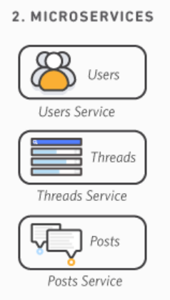

# Architecture Logicielle

- monolithique => 1 seul gros projet (MVC), micro-services => authentification (SSO), Event-Driven => Winform, Hexa => optimisation séparation des responsabilités, code métier, etc...

## Définitions

- rigidité => Capacité d'un système à s'adapter aux changement
- scalabilité => Capacité d'une application grossir 
- overengineering =>

# TP 1 :

Faire des recherches sur chacun des 4 types d'architecture cités plus haut. Pour chacun récupérer :

- Une liste de caractéristiques
- Une définition simple et efficace
- Des exemples d'implémentation (schémas ?)
- Des exemples d'utilisation dans des projets connus
- La liste des sources (liens web) où vous avez trouvé les informations

## Monolithique

### Caractéristiques

- Base de code unique
- Généralement regroupant l'interface utilisateur, la base de données et l'application côté serveur
- Rapide et facile à concevoir
- Une seule unité à déployer
- S'exécute sur un seul serveur
- Scalabilité plus limitée parce qu'elle affecte un système entier
- Système moins flexible lorsqu'il s'agit d'ajouter des nouvelles fonctionnalités
- Pose un risque de point de défaillance unique qui entraînerait l'échec de toute l'application
- Si plus de ressources doivent être allouées, c'est tout le système qui prend les ressources => On passe très vite dans du gaspillage de ressources
- Limite l'introduction de nouvelles fonnctionnalités

|                    Avantages                    | Inconvénients                                     |
|--------------------------------------------------|---------------------------------------------------|
|Pas besoin de traduire le code entre les services | Assez rigide : Difficile d'intégrer des nouvelles | 
|                                                  | technologies                                      |
|Plus facile à développer et à déployer            | Difficile à faire évoluer                         |
|Plus facile à tester, notamment en end-to-end     | Un changement peut modifier en cascade=>peu agile |
|Plus sécurisé, car moins de communication         | Obligé de tout rebuild et redéployer à chaque     |
|extérieure                                        | changement                                        |  
|Indépendante                                      | Une erreur peut tout arrêter, même si elle est    |
|                                                  | localisée                                         |
|Performante                                       | Nécessite une équipe bien organisée               |

De plus en plus d'applications passent d'une architecture Monolithique à une architecture Micro-serivice

### Définition

L'architecture monolithique utilise une base de code unique pour plusieurs fonctions métiers,
chaque service sont interdépendants, ce qui implique que la moindre modification peut avoir des répercussions sur le reste de l'application.
Modèle de développement logiciel utilisant une base de code unique qui centralise des composants interdépendants afin d'exécuter différentes fonctions métier.

Une architecture monolithique peut être envisageable voire nécessaire dans des petits projets. Mais dès que le projet se complexifie, il peut être compliqué de le maintenir.
Une architecture monolithique représente un système simple, développé sur une même base de code. Généralement constitué d'un front, d'un back et d'une BDD.

### Exemples d'implémentations (schémas)

- Monolithe modulaire (ou diagramme de composants) : un seul système découpé en plusieurs modules, donc une séparation des couches existant tout de même sur une même base de code
- Diagramme de dépendances : structuration du code monolithe par fonctionnalité plutôt que par couche, limitant les interfaces

Exemple d'architecture monolithique

### Exemples d'utilisation dans des projets connus

- GitLab est sur une architecture "Monorails", basée sur le framework "Ruby on Rails"
- Instagram Server est également un système monolithe fonctionnant sous Django
- CMS (Wordpress, Shopify, Prestashop)
- Les applications Legacy (les anciennes versions de Microsoft Office)

### Sources

[devTo](https://dev.to/adrianbailador/monolithic-architecture-in-net-33i2)
[medium](https://medium.com/@AtefMADDOURI/architecture-microservice-vs-monolithique-8b019834ba35)
[gitlab](https://about.gitlab.com/blog/why-were-sticking-with-ruby-on-rails/)
[hadbook](https://handbook.gitlab.com/handbook/engineering/architecture/design-documents/modular_monolith/)
[instagram](https://instagram-engineering.com/static-analysis-at-scale-an-instagram-story-8f498ab71a0c)
[Atlassian](https://www.atlassian.com/fr/microservices/microservices-architecture/microservices-vs-monolith)
[Amazon](https://aws.amazon.com/fr/compare/the-difference-between-monolithic-and-microservices-architecture/)
[F5](https://www.f5.com/fr_fr/glossary/monolithic-application#:~:text=Syst%C3%A8mes%20bancaires%20%E2%80%93%20De%20nombreux%20syst%C3%A8mes,qui%20les%20rend%20plus%20s%C3%BBrs.)
[IBM](https://www.ibm.com/think/topics/monolithic-architecture)
[vFunction](https://vfunction.com/blog/what-is-monolithic-application)

## Micro-services

### Caractéristiques
- Composants logiciels indépendants dotés de fonctionnalités autonomes qui communiquent entre eux à l'aide d'API.
- Nécessite davantage de planification et d'infrastructure au départ, mais devient plus facile à gérer et à maintenir dans la durée.
- Chaque microservice est une entité logicielle indépendante qui nécessite un déploiement conteneurisé individuel.
- Nécessite des outils de débogage avancés pour suivre l'échange de données entre plusieurs microservices.
- Modifications des microservices individuels sans affecter l'ensemble de l'application.
- Allocations des ressources individuellement, en fonction des besoins => Economie des coûts
- Promeut l'expertise par équipe
- Possibilité de changer de technologies selon les services
- Plus facile de mettre en place un CI/CD
- La communication par API peut exposer à des faiblesses de sécurité
- Peut être moins performante

- Architecture de plus en plus populaire

### Définition
Une architecture micro-service représente des systèmes plus complexes où chaque fonctionnalité est indépendante.
Ils offrent une meilleure tolérance aux problèmes techniques et une plus grande flexibilité par rapport aux architectures monolithiques.

### Exemples d'implémentations

### Cas d'utilisations
- Netflix (une des premières grosses entreprises a être passée de monolithique à micro-services, elle à même remporté le 2015 JAX Special Jury Award)
- Microsoft Office
- Amazon
- Soundcloud

### Sources
- AWS
- talend
- [IBM](https://www.ibm.com/think/topics/monolithic-architecture)
- [vFunction](https://vfunction.com/blog/what-is-monolithic-application)

https://www.allthingsdistributed.com/2019/08/modern-applications-at-aws.html

https://developers.soundcloud.com/blog/microservices-and-the-monolith

## Event-driven

### Caractéristiques
- Exécution de la couche métier à partir d'évènements
- Est constitué de 3 éléments : les producteurs d'évènements, les routeurs d'évènements et les consommateurs d'évènements
- Utilisé dans les applications micro-services
- Permet de coordonner les micro-services
- Très libre en therme de langage et plateforme d'exécution
- Un événement peut avoir comme source des entrées internes ou externes. Les événements peuvent être générés par un utilisateur (par exemple, clic de souris, frappe au clavier), une source externe (par exemple, une sortie de capteur) ou le système (par exemple, le chargement d'un programme).
- Adaptation aux changements, en prenant des décisions en temps réel

Modèle de publication/abonnement
Il s'agit d'une infrastructure de messagerie basée sur l'abonnement à un flux d'événements. Avec ce modèle, une fois qu'un événement s'est produit ou a été publié, il est envoyé aux abonnés qui doivent en être informés.

Modèle de flux d'événements
Avec un modèle de flux d'événements, les événements sont écrits dans un journal. Les consommateurs d'événements ne s'abonnent pas à un flux d'événements. Ils peuvent lire toute partie du flux et le rejoindre à tout moment.

- Couplage moins étroit (l'émetteur et le consommateur ne se connaissent pas)
- Grande flexibilité
- En cas de panne, les messages s'empilent dans une file d'attente et ne sont pas perdus
- Peut être implémenté dans des microservices, mais il est moins recommandé dans une solution monolithe
- Offre un traitement en temps réel, ou à faible latence
- Les événéments sont persistants, ils sont conservés pendant un certain temps pour qu'ils puissent être consommés à n'importe quel moment

### Définition
Un système orienté événements est conçu pour capturer, communiquer et traiter les événements entre des services dissociés. Les systèmes peuvent ainsi rester asynchrones tout en partageant des informations et en accomplissant des tâches. 

L'event driven architecture (EDA) est un modèle de conception logicielle centré sur tout ce qui est consommation,
réaction, détection et production d'évènement.

Un évènement est une action ou un état sur une app ou son environnement (clic de souris, réception de message, temprérature)

3 composants principaux pour une architecture EDA : 

- **Producteurs d'évènements** : génère les évènements qui sont envoyés au gestionnaire d'évènement ou au user direct. Ne se préoccupe plus de l'évènement après
- **Canal d'évènements** : C'est le medium, l'évènement qui passe du producteur au consommateur passe par le canal, il existe différente formes de canal tel les files, piles, bus
- **Consommateur d'évènements** : Il est abonné à un type d'évènements spécifique et exécute le traitement correspondant à son type d'évènement

**Flux de travail typique**

- Émission : Un producteur détecte un état ou un changement et crée un événement.
- Publication : L'événement est publié sur un canal.
- Réception : Les consommateurs abonnés au canal reçoivent l'événement.
- Traitement : Chaque consommateur effectue une action déterminée en réponse à l'événement.

**Avantage**

- Découplage : Les producteurs et consommateurs d'événements sont largement indépendants les uns des autres, ce qui facilite la maintenance et l'évolution du système.
- Réactivité : Les systèmes basés sur des événements sont très réactifs et peuvent traiter les changements en temps réel.
- Scalabilité : Il est plus facile de scaler un système EDA car on peut ajouter des consommateurs sans perturber les producteurs, et vice versa.
- Flexibilité : Les nouvelles fonctionnalités peuvent être intégrées comme nouveaux consommateurs d'événements sans modification du flux existant.

### Exemples d'implémentations
- Est utile pour de la surveillance de ressources
- 

- Système d'interface graphique, les actions utilisateur déclenchent des évènements
- Dispositif IoT
- Microservices

### Cas d'utilisations
- Sotheby's a mis en place une architecture de type EDA pour son système de gestion des enchères

- Netflix utilise l'EDA avec Apache Kafka 
- Uber

### Sources
- [aws](https://aws.amazon.com/fr/event-driven-architecture)
- [wikipedia](https://fr.wikipedia.org/wiki/Architecture_orientée_événements)
- [redhat](https://www.redhat.com/fr/topics/integration/what-is-event-driven-architecture)

[Bob le développeur](https://www.bob-le-developpeur.com/notions/event-driven-architecture)
[Microsoft](https://learn.microsoft.com/fr-fr/azure/architecture/guide/architecture-styles/event-driven)

## Hexa

### Caractéristiques
- Coeur métier isolé : la logique métier (domain + use cases) ne dépend pas de la BDD, du framework web, ni de l’UI. 
- Ports : ce sont des interfaces définies par le domaine pour interagir avec l’extérieur (ex. UserRepository, PaymentGateway, EmailSender). 
- Adapters : ce sont des implémentations concrètes des ports (ex. SqlUserRepository, MongoUserRepository, controller REST, CLI, etc.). 
- Symétrie entrée / sortie : UI, API, BDD, queue de messages, tests automatiques sont tous vus comme des “clients” branchés sur le même cœur via des ports. 
- Faible couplage & forte testabilité : tu peux tester le cœur métier avec des doubles (mocks/fakes) sans démarrer BDD ni serveur HTTP. 
- Échangeabilité des technos : tu peux remplacer une BDD, un système de paiement, une API externe en changeant seulement l’adapter. 
- Compatible DDD / Clean Architecture : très utilisé avec Domain-Driven Design et apparenté aux autres archis “domain-centric” (Onion, Clean). 
- Alternative aux couches classiques : ce n’est pas qu’un empilement UI → Service → Repository ; le cœur ne “voit” pas l’infrastructure. 

3 couches :
- Domaine : cette couche contient la logique métier centrale de l’application. Elle est indépendante des autres couches et encapsule toutes les règles et comportements spécifiques au domaine.
- Application : la couche application orchestre les cas d’utilisation et les interactions entre le domaine et les autres composants. Elle ne contient aucune logique métier mais appelle les services du domaine.
- Infrastructure : cette couche gère les détails techniques tels que la base de données, les API externes, les interfaces utilisateur, etc. Elle contient les implémentations concrètes nécessaires pour le fonctionnement de l’application

L'infrastructure, c'est la couche qui contient tout ce qui est technique et spécifique aux dépendances

Isoler la couche métiers des autres couches de l'application
Les autres couches sont reliées au bloc métier via des ports et des adaptateurs pour discuter avec l'extérieur

Adaptateurs d'entrée : Ils permettent d'ingérer des données d'autres services techniques, on spécifie nous-mêmes les règles
donc c'est de l'inversion de dépendance, on peut ajouter des couches techniques sans toucher au métier,
c'est la technique qui est formattée pour être adaptée à la couche métier,
ainsi pas besoin de modifier la couche métier ainsi + de capacité d'adaptation

Adaptateurs de sortie : Envoyer les données aux couches extérieures compréhensible pour les services externes

Si on veut ajouter un nouveau service, il suffit d'ajouter un nouvel adaptateur

Inversion de dépendance, c'est le serveur qui décide du protocol de communication, pas l'inverse

### Définition

L'architecture hexagonale isole la couche métier du reste de la solution en le faisant dépendre uniquement des ports. Les adaptateurs implémentent ces ports, des interfaces, pour connecter la logique métier aux couches externes (base de données, UI, API, file de messages)

### Exemples d'implémentations

### Cas d'utilisations
- MMA
### Sources
https://alistair.cockburn.us/hexagonal-architecture
https://en.wikipedia.org/wiki/Hexagonal_architecture_(software)
https://blog.octo.com/architecture-hexagonale-trois-principes-et-un-exemple-dimplementation
https://docs.aws.amazon.com/prescriptive-guidance/latest/cloud-design-patterns/hexagonal-architecture.html
https://www.baeldung.com/hexagonal-architecture-ddd-spring
https://www.arhohuttunen.com/hexagonal-architecture-spring-boot/
https://scalastic.io/en/hexagonal-architecture/
https://codesoapbox.dev/ports-adapters-aka-hexagonal-architecture-explained/
https://miladezzat.medium.com/hexagonal-architecture-ports-and-adapters-pattern-5ad2421802ec
https://github.com/alexander-schranz/hexagonal-architecture-study

[Code Insider](https://www.youtube.com/watch?v=wKXUd_WbTTc)
[Zenika TV](https://www.youtube.com/watch?v=MNXcuIGmYQw&t=30s)
[Medium - Ports and Adapters](https://medium.com/@tejasrawat_82721/hexagonal-architecture-ports-and-adapters-explained-a-practical-guide-from-concept-to-code-7903053f38f4)
